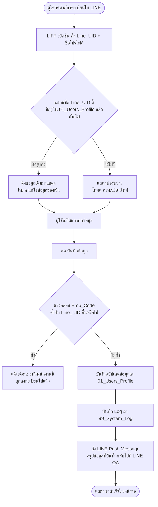

# Functional & Technical Specification
## LINE LIFF Self-Registration Module (User Profile Onboarding)
**Project:** IT Management & COSO-ITGC Compliance System
**Module Code:** REG-001
**อ้างอิง Sheet:** `01_Users_Profile` (ตามที่กำหนดใน `config.gs`)
**Config Constant ที่ต้องใช้ (ห้าม Hardcode ซ้ำ):** `CONFIG.SHEETS.USERS_PROFILE`

---

## 1. วัตถุประสงค์


ให้พนักงานลงทะเบียนข้อมูลส่วนตัวเข้าสู่ระบบด้วยตนเองผ่าน LINE LIFF โดยไม่ต้องให้เจ้าหน้าที่ IT เป็นผู้คีย์ข้อมูลแทน เพื่อผูก `Line_UID` ของพนักงานเข้ากับข้อมูลใน Sheet `01_Users_Profile` สำหรับใช้เป็นฐานการยืนยันตัวตน (Authentication) ของทั้งระบบต่อไป

## 2. จุดเข้าถึง (Entry Point) และรูปแบบ Auth — สำคัญ อ่านก่อนเขียนโค้ด

* ผู้ใช้เข้าถึงฟอร์มนี้ผ่าน **Link ที่ IT ส่งให้ทาง LINE เท่านั้น** (เช่น วางไว้ใน Rich Menu หรือส่งเป็นข้อความ Broadcast จาก LINE OA) **ไม่ผ่านเมนูหลักของระบบ**
* URL Pattern: `index.html?action=register`
* **[กฎเหล็ก] จุดนี้ต้องข้าม App Shell ปกติทั้งหมด** — ห้ามเช็ค `Is_Active` และห้ามเช็ค `Scr_xx` ใด ๆ ก่อนเข้าฟอร์มนี้เด็ดขาด เพราะผู้ใช้ที่เข้ามาคือคนที่ **ยังไม่มีชื่ออยู่ใน `01_Users_Profile` เลย** ถ้าไปเช็คก่อนจะบล็อกผู้ใช้ทุกคนออกตั้งแต่ต้นทาง (ใช้หลักการเดียวกับ Form 7.1 ที่เคยกำหนดไว้)
* หน้าจอนี้ **ต้องออกแบบให้ใช้งานบนมือถือเป็นหลัก (Mobile-First)** เพราะเปิดผ่าน LINE บนมือถือ 100%

## 3. Flow การทำงาน (ภาพรวม)



## 4. ฟิลด์ในฟอร์ม (UI Specification)

## การออกแบบฐานข้อมูล (Database Design)**

*หมายเหตุ: ทุกตารางที่มี Transaction ควรมี Created_LineUID, Approve_LineUID (ถ้ามีขั้นตอนอนุมัติ), Last_Update และ PDF_Link (ถ้ามีการสร้าง PDF) เสมอ*

### **0. Master Data (Sheet: 01_Users_Profile)**

| Sheet Name | Field Name | Type | Description |
| :---- | :---- | :---- | :---- |
| **01_Users_Profile** | Line_UID | String (PK) | รหัสจาก LIFF |
|  | Line_ProfileName | String | ชื่อใน LINE |
|  | FullNameTH | String | ชื่อนามสกุลพนักงาน THAI |
|  | FullNameEN | String | ชื่อนามสกุล ENG |
|  | Emp_Code | String | รหัสพนักงาน |
|  | Department | String | หน่วยงาน |
|  | Tel, Email | String | ข้อมูลติดต่อ |
|  | Is_Active | Boolean | Yes / No (Default: Yes) — **ใช้เฉพาะฟอร์มกลุ่ม A เท่านั้น ฟอร์มกลุ่ม B (Deep Link) ไม่เช็คค่านี้** |
|  | Last_Update | DateTime | วันที่แก้ไขล่าสุด |
|  | Scr_01 | Boolean | สิทธิ์เข้าถึง **Form 1.1** (Yes/No) |
|  | Scr_02 | Boolean | ⚠️ **ไม่ใช้งานแล้ว** — Form 1.2 เข้าผ่าน Deep Link เท่านั้น ไม่เช็คค่านี้ (เก็บคอลัมน์ไว้เพื่อไม่ให้เลข Scr ขยับ) |
|  | Scr_03 | Boolean | สิทธิ์เข้าถึง **Form 1.3** (Yes/No) |
|  | Scr_04 | Boolean | สิทธิ์เข้าถึง **Form 2.1** (Yes/No) |
|  | Scr_05 | Boolean | สิทธิ์เข้าถึง **Form 2.2** (Yes/No) |
|  | Scr_06 | Boolean | สิทธิ์เข้าถึง **Form 3.1** (Yes/No) |
|  | Scr_07 | Boolean | สิทธิ์เข้าถึง **Form 4.1** (Yes/No) |
|  | Scr_08 | Boolean | ⚠️ **ไม่ใช้งานแล้ว** — ยุบรวมเข้ากับ Form 4.1 แล้ว (เก็บคอลัมน์ไว้เพื่อไม่ให้เลข Scr ขยับ) |
|  | Scr_09 | Boolean | ⚠️ **ไม่ใช้งานแล้ว** — Form 4.3 เข้าผ่าน Deep Link เท่านั้น ไม่เช็คค่านี้ |
|  | Scr_10 | Boolean | สิทธิ์เข้าถึง **Form 4.4** (Yes/No) |
|  | Scr_11 | Boolean | สิทธิ์เข้าถึง **Form 5.1** (Yes/No) |
|  | Scr_12 | Boolean | สิทธิ์เข้าถึง **Form 5.2** (Yes/No) |
|  | Scr_13 | Boolean | สิทธิ์เข้าถึง **Form 6.1** (Yes/No) |
|  | Scr_14 | Boolean | ⚠️ **ไม่ใช้งานแล้ว** — Form 6.2 เข้าผ่าน Deep Link เท่านั้น ไม่เช็คค่านี้ |
|  | Scr_15 | Boolean | ⚠️ **ไม่ใช้งานแล้ว** — Form 7.1 เปิด Public ไม่เช็ค Users_Profile เลย |
|  | Scr_16 | Boolean | ⚠️ **ไม่ใช้งานแล้ว** — Form 7.2 เข้าผ่าน Deep Link เท่านั้น ไม่เช็คค่านี้ |
|  | Scr_17 | Boolean | สิทธิ์เข้าถึง **Form 8.1** (Yes/No) |


อ้างอิงคอลัมน์จาก `01_Users_Profile` เฉพาะส่วนที่ผู้ใช้กรอกได้เท่านั้น ห้ามเพิ่ม/ลดฟิลด์เอง

| ลำดับ | ฟิลด์ | ที่มาของค่า | ประเภท Input | บังคับกรอก | หมายเหตุ |
|---|---|---|---|---|---|
| 1 | `Line_UID` | Auto: `liff.getProfile().userId` | Hidden | ใช่ | ผู้ใช้แก้ไขไม่ได้ |
| 2 | `Line_ProfileName` | Auto: `liff.getProfile().displayName` | Read-only แสดงบนจอ | ใช่ | ใช้แสดงทักทายผู้ใช้ เช่น "สวัสดีคุณ {ชื่อ}" |
| 3 | `FullNameTH` | ผู้ใช้กรอก | Text Input | ใช่ | ชื่อ-นามสกุลภาษาไทย |
| 4 | `FullNameEN` | ผู้ใช้กรอก | Text Input | ใช่ | ชื่อ-นามสกุลภาษาอังกฤษ |
| 5 | `Emp_Code` | ผู้ใช้กรอก | Text Input | ใช่ | รหัสพนักงาน — ใช้เป็น Key สำคัญของทั้งระบบ ต้องตรวจสอบไม่ให้ซ้ำ (ดูข้อ 6) |
| 6 | `Department` | ผู้ใช้เลือก | Dropdown | ใช่ | ตัวเลือกใช้ชุดเดียวกับ Role ใน Form 1.1: MGMT, SALES, PLAN, DESIGN, CONSTRUCTION, PURCHASE, STORE, ACC, FN, HR |
| 7 | `Tel` | ผู้ใช้กรอก | Text Input (ตัวเลข) | ใช่ | ตรวจสอบเบื้องต้นว่ากรอกเป็นตัวเลข 9-10 หลัก |
| 8 | `Email` | ผู้ใช้กรอก | Text Input | ไม่บังคับ | - |

**ฟิลด์ที่ระบบกำหนดเองอัตโนมัติ ห้ามให้ผู้ใช้เห็นหรือแก้ไขในฟอร์ม:**

| ฟิลด์ | ค่าที่ระบบตั้งให้ตอนลงทะเบียนใหม่ | พฤติกรรมตอนแก้ไขข้อมูลเดิม |
|---|---|---|
| `Is_Active` | `Yes` (Default) | **ห้ามเขียนทับ** ใช้ค่าเดิมที่มีอยู่ในระบบเสมอ |
| `Scr_01` – `Scr_17` | เว้นว่าง / `No` ทั้งหมด (สิทธิ์เมนูให้ IT เป็นผู้เปิดทีหลังผ่านการแก้ Sheet เอง) | **ห้ามเขียนทับ** ใช้ค่าเดิมที่มีอยู่ในระบบเสมอ |
| `Last_Update` | Timestamp ปัจจุบัน (Asia/Bangkok ตาม `CONFIG.TIMEZONE`) | อัปเดตใหม่ทุกครั้งที่บันทึก |

## 5. Business Logic ฝั่ง Backend (GAS) — ทำตามนี้ทุกข้อ ห้ามออกแบบเพิ่มเอง

### 5.1 `doGet` (action = `register`)
1. รับ `line_uid` จาก Query Parameter (Frontend ส่งมาหลัง `liff.getProfile()`)
2. ค้นหาใน `01_Users_Profile` ว่ามีแถวที่ `Line_UID` ตรงกันหรือไม่
3. ถ้า **พบ** → Return ข้อมูลปัจจุบันทั้งหมดของแถวนั้นกลับไปเป็น JSON (ยกเว้น `Scr_xx`) → Frontend นำไป Pre-fill ฟอร์ม และเปลี่ยน Label ปุ่มเป็น **"บันทึกการแก้ไข"**
4. ถ้า **ไม่พบ** → Return ฟอร์มเปล่า → Frontend แสดง Label ปุ่มเป็น **"ลงทะเบียน"**

### 5.2 `doPost` (action = `register_submit`)
1. รับข้อมูลจาก Frontend ตามฟิลด์ในข้อ 4 (ไม่รวมฟิลด์ที่ระบบกำหนดเอง)
2. **Validate:** ทุกฟิลด์ที่บังคับกรอกต้องไม่ว่าง ถ้าว่างให้ Reject พร้อมข้อความระบุฟิลด์ที่ขาด
3. **ตรวจสอบ Emp_Code ซ้ำ:** ค้นหาใน `01_Users_Profile` ว่ามีแถวอื่นที่ `Emp_Code` เดียวกันนี้ แต่ `Line_UID` **ไม่ตรง** กับผู้ที่กำลังบันทึกหรือไม่
   * ถ้าพบ → Reject ทันที พร้อมข้อความ "รหัสพนักงานนี้ถูกลงทะเบียนไว้แล้ว กรุณาติดต่อ IT หากคิดว่าเป็นข้อผิดพลาด" **ห้ามบันทึกทับ**
4. ใช้ `LockService.getScriptLock()` ครอบขั้นตอนการเขียน Sheet ทั้งหมด (ตามรูปแบบเดียวกับโมดูลอื่นในระบบ)
5. ตรวจสอบว่า `Line_UID` นี้มีแถวอยู่แล้วหรือไม่:
   * **มีอยู่แล้ว (Update):** เขียนทับเฉพาะฟิลด์ในข้อ 4 (ข้อ 3-8) เท่านั้น **ห้ามแตะ `Is_Active` และ `Scr_01`–`Scr_17` ที่มีอยู่เดิมเด็ดขาด** อัปเดต `Last_Update` เป็นเวลาปัจจุบัน
   * **ยังไม่มี (Insert):** เพิ่มแถวใหม่ ตั้งค่า `Is_Active = Yes`, `Scr_01`–`Scr_17` ทั้งหมด = ว่าง/`No`, `Last_Update` = เวลาปัจจุบัน
6. บันทึก Log ลง `99_System_Log` (`Module_Name = "Registration"`, `Action_Type = "INSERT"` หรือ `"UPDATE"` ตามกรณี, `Raw_JSON` = ข้อมูลทั้งหมดที่ส่งเข้ามา)
7. เรียกฟังก์ชันส่ง LINE Push Message (ดูข้อ 6) — **ห้ามทำให้ขั้นตอนการบันทึก Fail ถ้า Push ส่งไม่สำเร็จ** ให้ครอบด้วย `try...catch` แยกออกจาก Logic การบันทึกข้อมูล (บันทึกข้อมูลสำเร็จแล้วถือว่าจบ Transaction ไม่ว่า Push จะสำเร็จหรือไม่)
8. Return ผลลัพธ์ `{ success: true }` กลับไปที่ Frontend

## 6. LINE Push Message — สรุปข้อมูลกลับไปที่ LINE OA

* **Trigger:** ทันทีหลังบันทึกข้อมูลสำเร็จ (ทั้งกรณีลงทะเบียนใหม่และแก้ไขข้อมูล) ภายใน `doPost` เดียวกัน (Session เดียวกับที่ผู้ใช้เพิ่งกดบันทึก)
* **ใช้ LINE Messaging API (Push Message)** เท่านั้น ผ่าน Channel Access Token ที่กำหนดไว้ใน `config.gs` (เพิ่ม Key `CONFIG.LINE_CHANNEL_ACCESS_TOKEN` ถ้ายังไม่มี)
* **รูปแบบข้อความ (Baseline — ข้อความธรรมดา):**
  ```
  ✅ บันทึกข้อมูลลงทะเบียนเรียบร้อย

  ชื่อ-นามสกุล (TH): {FullNameTH}
  ชื่อ-นามสกุล (EN): {FullNameEN}
  รหัสพนักงาน: {Emp_Code}
  แผนก: {Department}
  เบอร์โทร: {Tel}
  อีเมล: {Email}

  หากข้อมูลไม่ถูกต้อง กรุณาเปิดลิงก์เดิมเพื่อแก้ไขได้ทันที
  ```
* ส่งไปยัง `Line_UID` ของผู้ที่เพิ่งบันทึกเท่านั้น (ใช้ค่าที่ได้จาก LIFF ในคำขอเดียวกัน)
* **ข้อควรระวังทางเทคนิค:** การ Push จะสำเร็จก็ต่อเมื่อผู้ใช้เป็นเพื่อน (Friend) กับ LINE OA อยู่ก่อนแล้วเท่านั้น — เนื่องจาก Flow นี้ผู้ใช้ต้องเปิดผ่าน LINE OA อยู่แล้วความเสี่ยงจุดนี้ต่ำกว่ากรณี Async Notification ที่เคยตัดออกไปก่อนหน้านี้ แต่ยังคงต้องครอบ `try...catch` ตามข้อ 5.2 ข้อ 7 เพื่อความปลอดภัย

## 7. โครงสร้างไฟล์ที่ต้องสร้าง (ตามรูปแบบแยกไฟล์ที่ใช้อยู่ในโปรเจกต์)

| ไฟล์ | หน้าที่ |
|---|---|
| `Mod_Registration.gs` | รวม Business Logic ทั้งหมดของโมดูลนี้ (`doGet`/`doPost` Handler เฉพาะ `action=register`, `action=register_submit`) |
| `Form_Register.html` | หน้าฟอร์มลงทะเบียน ตามฟิลด์ในข้อ 4 |
| `Code.gs` | เพิ่ม Route `action=register` และ `action=register_submit` ให้ชี้มาที่ `Mod_Registration.gs` เท่านั้น ห้ามใส่ Logic ของโมดูลนี้ไว้ใน `Code.gs` |
| `config.gs` | **ใช้ไฟล์ที่แนบมาให้ตามนี้เป๊ะ ๆ ห้ามแก้ไขค่าคงที่ใด ๆ ในไฟล์นี้ หากขาด Key ที่ต้องใช้เพิ่ม (เช่น `LINE_CHANNEL_ACCESS_TOKEN`) ให้เพิ่มเข้าไปในโครงสร้าง Object เดิม ห้ามสร้างไฟล์ Config ใหม่แยกต่างหาก** |

ใช้ Function ร่วมจาก `Utils.gs` ที่มีอยู่แล้วในโปรเจกต์สำหรับ: การอ่าน/เขียน Sheet, การเขียน Log ลง `99_System_Log`, การจัดการ Lock — **ห้ามเขียนฟังก์ชันเหล่านี้ซ้ำใน `Mod_Registration.gs`**

---

## 8. หมายเหตุจาก SA/DBA (จุดที่ควรทราบไว้ ไม่ใช่ข้อบังคับให้แก้)

การลงทะเบียนแบบ Self-Service นี้ยังไม่มีการตรวจสอบว่า `Emp_Code` ที่ผู้ใช้กรอกเป็นของตัวเองจริงหรือไม่ (ไม่มี Master List จาก HR มาช่วย Validate) ระบบตอนนี้ป้องกันได้แค่ระดับ **"กันไม่ให้ Emp_Code ซ้ำกันระหว่าง 2 คน"** เท่านั้น ยังไม่ได้ป้องกัน **"คนแอบอ้างเป็นอีกคน"** หากในอนาคตต้องการความรัดกุมกว่านี้ (เช่น รองรับการ Audit-IPO ที่เข้มขึ้น) ค่อยพิจารณาเพิ่ม Master List จาก HR มา Cross-check ทีหลังได้ — รอบนี้ทำตามที่ระบุไว้ในเอกสารนี้ก่อนตามที่ตกลงกัน

---

## 9. Prompt สำหรับส่งให้ทีมงาน AI Coding (Copy วางได้เลย)

```
อ่านเอกสาร Spec โมดูล "LINE LIFF Self-Registration" ที่แนบมาให้ทั้งหมดก่อนเริ่มเขียนโค้ด
พร้อมกับไฟล์ config.gs ที่แนบมาด้วย (ใช้ไฟล์นี้ตรง ๆ ห้ามสร้างไฟล์ config ใหม่ ห้ามแก้ไขค่าคงที่
ที่มีอยู่แล้วในไฟล์นี้ หากต้องเพิ่ม Key ใหม่ เช่น LINE_CHANNEL_ACCESS_TOKEN ให้เพิ่มในโครงสร้าง
Object เดิมเท่านั้น  สำหรับค่า LINE CHANNEL ACCESS TOKEN ที่ใช้ ใน project นี้คือ "2009016720-0Df5GB2w" )  

ให้ทำตามเงื่อนไขในเอกสารทุกข้อแบบเป๊ะ ๆ ไม่ต้องออกแบบเงื่อนไขทางธุรกิจเพิ่มเติมเอง หากมีจุดที่
เอกสารไม่ได้ระบุไว้ ให้หยุดถามก่อน ไม่ต้องเดาแล้วเขียนต่อไปเอง

ข้อกำหนดสำคัญที่ต้องยึดตามเป๊ะ ๆ:

1. ฟิลด์ในฟอร์มต้องตรงกับตารางในข้อ 4 ของเอกสารเป๊ะ ๆ ห้ามเพิ่มห้ามลดฟิลด์เอง
2. ห้ามให้ Logic เขียนทับคอลัมน์ Is_Active และ Scr_01-Scr_17 ที่มีอยู่เดิมเด็ดขาดในทุกกรณี
   (ทั้งตอน Insert ใหม่และ Update ข้อมูลเดิม ตามที่ระบุไว้ในข้อ 5.2)
3. ต้องมีการตรวจสอบ Emp_Code ซ้ำก่อนบันทึกทุกครั้งตามข้อ 5.2 ข้อ 3
4. ต้องส่ง LINE Push Message กลับไปสรุปข้อมูลที่บันทึกตามรูปแบบในข้อ 6 และห้ามทำให้ขั้นตอน
   การบันทึกข้อมูล Fail หาก Push ส่งไม่สำเร็จ (ครอบด้วย try...catch แยกต่างหาก)
5. ต้องแยกไฟล์ตามที่ระบุในข้อ 7 ห้ามรวม Logic ไว้ใน Code.gs และห้ามเขียนฟังก์ชันที่มีอยู่แล้ว
   ใน Utils.gs ซ้ำอีก
6. UI ต้องออกแบบให้ใช้งานบนมือถือเป็นหลัก (Mobile-First) ใช้ Bootstrap5 + SweetAlert2
   ตามชุดเดียวกับโมดูลอื่นในโปรเจกต์นี้ และใช้รูปแบบ CORS แบบ text/plain ตามที่ใช้อยู่แล้ว
   ในโปรเจกต์ (ห้ามใช้ Content-Type: application/json)

ก่อนเริ่มเขียนโค้ดจริง ให้แสดง File Tree ที่วางแผนไว้ และสรุปเงื่อนไขทั้งหมดที่เข้าใจกลับมา
ให้ผมยืนยันก่อน 1 รอบ ยังไม่ต้องเขียนโค้ดจนกว่าผมจะ Confirm
```


**End of Document**
